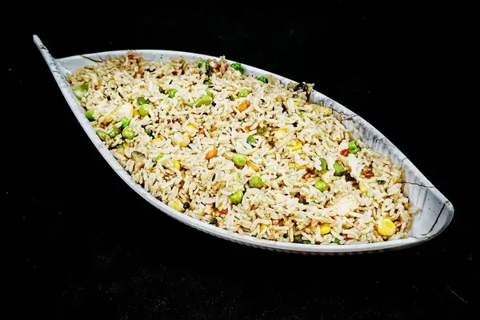

# 🖼️ Image Workflow Documentation - The Oven Vibe

## Overview

This document explains how to add new menu images to The Oven Vibe website. The site uses an **efficient CSS-based approach** where images are displayed as perfect 1:1 squares with center cropping (Zomato style).

---

## 📋 Quick Summary

**Current Image Display Strategy:**

- ✅ Images stored as **3:2 aspect ratio** (600x400px or 1800x1200px)
- ✅ **CSS `object-fit: cover`** automatically crops to 1:1 squares with center zoom
- ✅ **No image conversion needed** for display
- ✅ Supports WebP, AVIF, JXL formats in `<picture>` elements with fallbacks

---

## 🎯 When Adding a New Image to the Menu

### Step 1: Prepare the Image

1. **Source format**: Any image format (JPG, PNG, etc.)
2. **Aspect ratio**: 3:2 (e.g., 600x400px, 1200x800px, 1800x1200px)
3. **Quality**: Use high-quality images; they'll be compressed during conversion
4. **Naming**: Use clear, descriptive names matching menu item names

**Example**: `Paneer Tikka Pizza.jpg`

---

### Step 2: Place Image in Source Directory

```
static/images/menu zomato/
├── Fried Rice Bowls/
│   ├── Veg Fried Rice.avif
│   ├── Garlic Fried Rice.avif
│   └── Mixed Tresure Fried Rice Zomato.avif  ← NEW IMAGE HERE
├── Pizza/
├── Pasta/
├── Grilled Sandwiches/
├── Sides & Snacks/
└── Combo/
```

**How to add:**

```bash
# 1. Place your source image in the appropriate subfolder
#    e.g., static/images/menu zomato/Fried Rice Bowls/
```

---

### Step 3: Run Image Conversion Scripts (in order)

These scripts generate **WebP and JXL** formats alongside the existing AVIF. They automatically:

- Detect the source image
- Create optimized versions for web
- Place files in `static/images/product_images/` and `static/images/combo_images/`

**Run these commands in sequence:**

```bash
# 1. Convert to 3:2 format and create base AVIF
python convert_images.py

# 2. Create WebP versions from AVIF
python convert_to_webp_jxl.py
```

**What this produces:**

```
static/images/product_images/
├── 751397746.avif  ← Primary format
├── 751397746.webp  ← Fallback format
└── 751397746.jxl   ← Modern format (optional)
```

---

### Step 4: Update menu.json

Add the new product to `menu.json` with:

- **product_code**: Unique 9-digit ID from your Excel/database
- **item_name**: Technical name
- **display_name**: What customers see
- **category**: Menu section
- **price**: Item price
- **description**: Item details
- **status**: "available" or "coming-soon"

**Example entry:**

```json
{
  "product_code": "751397746",
  "item_id": 5,
  "category": "Fried Rice Bowls",
  "subcategory": "Premium Veg Protein Bowls",
  "item_name": "Mixed Tresure Fried Rice Zomato",
  "display_name": "Mixed Treasure Fried Rice",
  "price": 169,
  "description": "[Veg preparation] Feast in a box paneer, baby corn...",
  "status": "available"
}
```

---

### Step 5: Verify Display

The website will automatically:

1. Read the `product_code` from `menu.json`
2. Look for images in `static/images/product_images/{product_code}.webp`
3. Display using CSS with **`object-fit: cover`** for perfect 1:1 square with center zoom
4. Use `<picture>` element for format fallbacks (WebP → JXL → AVIF)

✅ **No additional CSS needed!** The conversion is handled entirely by existing styles.

---

## 🛠️ Conversion Scripts Reference

### `convert_images.py`

**Purpose**: Converts menu images from 3:2 to 3:2 AVIF with proper catalogue IDs

**What it does:**

- Reads from `static/images/menu zomato/{category}/{item_name}.{ext}`
- Uses `IMAGE_MAPPING` dict to map display names to product_codes
- Outputs to `static/images/product_images/{product_code}.avif`

**When to use**: After adding a new image source file

**Config**: Edit `IMAGE_MAPPING` dict to add new items:

```python
"Fried Rice Bowls": {
    "Mixed Tresure Fried Rice Zomato": "751397746",  # Add here
}
```

---

### `convert_to_webp_jxl.py`

**Purpose**: Creates WebP and JXL versions from AVIF files

**What it does:**

- Scans `product_images/` for `.avif` files
- Creates `.webp` and `.jxl` versions with same basename
- Uses quality setting of 85 (high quality, smaller file size)

**When to use**: After `convert_images.py` succeeds

**No config needed** - fully automated!

---

### `convert_images_3_2.py`

**Purpose**: Alternative converter for 3:2 crops (unused in current setup)

**Status**: Available if needed for specific crop requirements
**Note**: Not required for standard workflow

---

### Other Utility Scripts

- **`organize_images.py`**: Reorganizes and categorizes image files
- **`create_placeholders.py`**: Generates placeholder images if needed

---

## 🎨 CSS Configuration (for Display)

The 1:1 square display is controlled by these CSS rules in `style.css`:

```css
/* Menu item images */
.item .thumb img {
  object-fit: cover;  ← ✨ KEY: Crops to 1:1 with center zoom
  border-radius: 8px;
  box-shadow: 0 2px 8px rgba(0, 0, 0, 0.04);
}

/* Combo images */
.combo .thumb img {
  object-fit: cover;  ← ✨ KEY: Same cropping behavior
}
```

**Why `object-fit: cover`?**

- Maintains 1:1 aspect ratio container (`aspect-ratio: 1 / 1`)
- Crops oversized images from center (Zomato style)
- No padding or white borders
- Responsive and efficient

---

## 📦 Directory Structure

```
theovenvibe.github.io/
├── convert_images.py                    ← Use this
├── convert_to_webp_jxl.py               ← Use this
├── convert_images_3_2.py                ← Backup (optional)
├── menu.json                            ← Update this
├── style.css                            ← Already configured
├── script.js                            ← Builds <picture> elements
└── static/
    └── images/
        ├── menu zomato/                 ← SOURCE IMAGES
        │   ├── Fried Rice Bowls/
        │   ├── Pizza/
        │   ├── Pasta/
        │   ├── Grilled Sandwiches/
        │   ├── Sides & Snacks/
        │   └── Combo/
        ├── product_images/              ← OUTPUT: Product images
        │   ├── 751393909.webp
        │   ├── 751393910.webp
        │   └── ...
        ├── combo_images/                ← OUTPUT: Combo images
        ├── add_on_images/               ← Add-on images
        └── brand_images/                ← Logo, QR codes, etc.
```

---

## 🔄 Complete Workflow Checklist

When adding a new menu item:

- [ ] **Prepare Image**

  - [ ] 3:2 aspect ratio (600x400px minimum)
  - [ ] High quality source file
  - [ ] Clear naming

- [ ] **Place Image**

  - [ ] Copy to correct subfolder in `menu zomato/`
  - [ ] Match category (Fried Rice Bowls, Pizza, etc.)

- [ ] **Map to Product Code**

  - [ ] Add to `IMAGE_MAPPING` in `convert_images.py`
  - [ ] Use product code from Excel/database

- [ ] **Convert Images**

  - [ ] Run `python convert_images.py`
  - [ ] Run `python convert_to_webp_jxl.py`
  - [ ] Verify files in `product_images/`

- [ ] **Update Database**

  - [ ] Add entry to `menu.json`
  - [ ] Include product_code, name, price, description
  - [ ] Set status to "available"

- [ ] **Verify on Website**

  - [ ] Open `index.html` locally
  - [ ] Check image displays as 1:1 square
  - [ ] Verify center cropping (Zomato style)
  - [ ] Test on mobile responsiveness

- [ ] **Commit to Git**
  - [ ] Add image files to repo
  - [ ] Update `menu.json`
  - [ ] Commit with clear message: `"Add Mixed Tresure Fried Rice Zomato image"`

---

## 🚀 Quick Command Reference

```bash
# Add new image and convert (from root directory)
python convert_images.py      # Creates AVIF
python convert_to_webp_jxl.py # Creates WebP + JXL

# Check if images exist
ls static/images/product_images/751397746.*

# View conversion logs
python convert_images.py 2>&1 | tee conversion_log.txt
```

---

## 📱 How the Website Renders Images

1. **HTML** (`script.js` builds this):

   ```html
   <picture>
     <source
       type="image/avif"
       srcset="static/images/product_images/751397746.avif"
     />
     <source
       type="image/webp"
       srcset="static/images/product_images/751397746.webp"
     />
     <source
       type="image/jxl"
       srcset="static/images/product_images/751397746.jxl"
     />
     
   </picture>
   ```

2. **CSS** (enforces 1:1 square):

   ```css
   .item .thumb {
     aspect-ratio: 1 / 1; /* Square container */
   }
   .item .thumb img {
     object-fit: cover; /* Crop to fill container */
   }
   ```

3. **Result**: Perfect 1:1 square image with center zoom (Zomato style) ✨

---

## ❓ Troubleshooting

| Issue                    | Solution                                                             |
| ------------------------ | -------------------------------------------------------------------- |
| Image not found error    | Verify image name matches `IMAGE_MAPPING` exactly (case-sensitive)   |
| Wrong product code       | Double-check Excel database for correct 9-digit ID                   |
| Image displays stretched | Check CSS `object-fit: cover` applied; if not, refresh browser cache |
| WebP not created         | Run `convert_to_webp_jxl.py` after `convert_images.py`               |
| File size too large      | Increase quality parameter in converter script (0-100)               |

---

## 📝 Notes

- **Format preference**: WebP > AVIF > JXL (fallback chain)
- **Optimal size**: 600x400px for menu items, 1800x1200px for special items
- **Quality setting**: 85 is optimal (high quality, reasonable file size)
- **No conversion needed for display**: CSS handles all 1:1 square conversion
- **Backwards compatible**: Works with old 3:2 images without modification

---

## 🔗 Related Files

- `menu.json` - Product database
- `script.js` - Image rendering logic (line ~130: `buildPicture()`)
- `style.css` - CSS styling (line ~110: `.item .thumb img`)
- `convert_images.py` - Primary converter

---

**Last Updated**: November 24, 2025
**Version**: 2.0 (CSS-based display, no conversion needed for square display)
